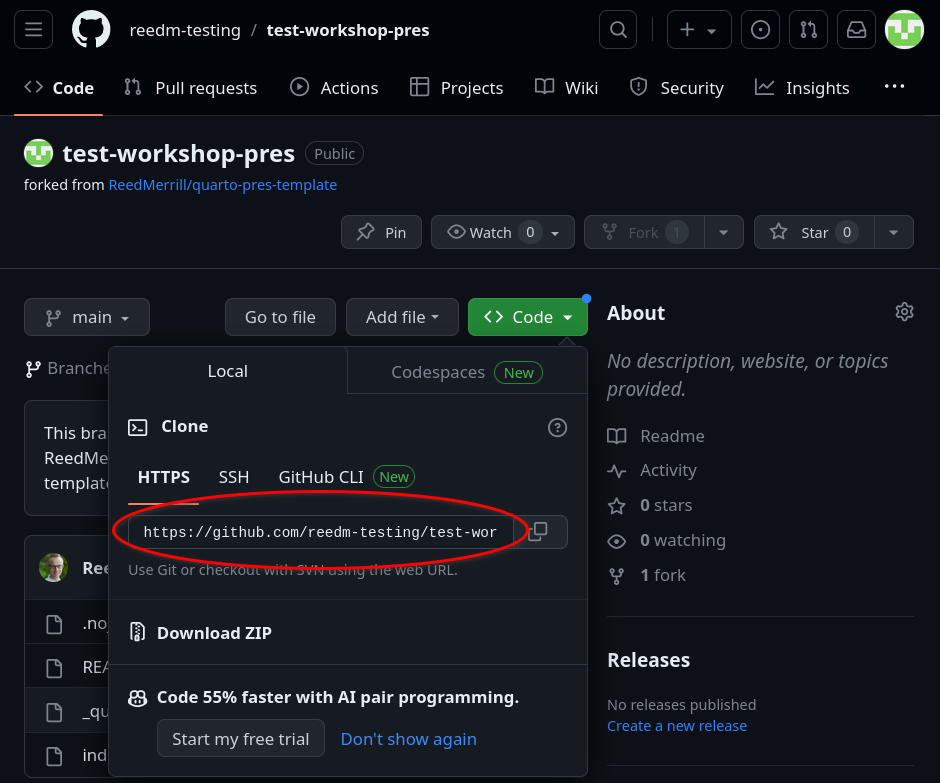
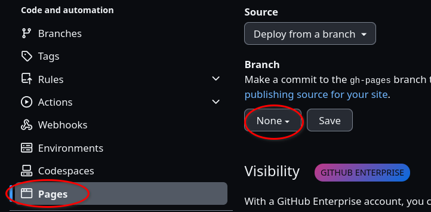

# Quarto Presentations on Github

>A template and tutorial for making and deploying beautiful presentations using Quarto Markdown and Github.
>This repository contains all the necessary files for creating a Quarto presentation that can be published using Github Pages.

## General Guidelines

- This template should also have a "docs" folder after the first time you render "index.qmd"
- "index.html" is the rendered versions of "index.qmd" and will be output into "docs", along other various files, every time you render your presentation.
- To stop this tutorial from showing on the main page of your repo, simply rename this file to something other than "README.md" and then commit the changes and push them to Github.
- I tend to call this a Quarto presentation, but it is really Quarto Markdown rendering a Reveal.js presentation for you. This framework is bound by what is possible within the Reveal.js framework, while providing the features of Quarto Markdown, which gives a very intuitive way to draft and format a presentation.

## Using This Template Repo

1. "Fork" the repo to your own Github account. This creates a copy of it that is yours. This step is necessary because the presentation will be published using the account that houses it on Github, and before forking it the repo is in @ReedMerrill, not your account. :wink:

2. After clicking "fork" you will be given an opportunity to rename the repo, and I recommend doing so because this is the only time it will be this easy. Name it anything that is useful to you. Click "Create fork".

- Now you'll be on a page that looks almost exactly like the one we started on before forking, but this time it's a copy of the repo under your Github account. Note too that *this* tutorial (the one you're currently reading) is again at the bottom of the page just like it was before forking. 

3. Copy your fork of the repo onto your computer. You need a special URL, which you can find by clicking on the green "code" button and copying the link under the HTTPS tab. 

4. Make a project in RStudio that is linked to your repo:

  - Click on the projects menu in the top right corner and select "New Project", then "Version Control", then "Git".
  - The other two fields will fill automatically, but you can edit if you'd like to.

5. Set up your Github repo to deploy your rendered presentation as a website. You can do this as follows:

  - Go to "Settings" in the top menu bar, near the green "code" button.
  - Click "Pages" in the left side-menu.
  - Click on The dropdown menu that says "none" and select "main".
  - A new dropdown will appear to the right of the one from the above step. Use it to select "docs".
  - Your presentation is ready to deploy! :sparkles:

6. Edit your presentation as usual. Every time you render "index.qmd" it will render or re-render "index.html" to the "docs" folder. Because you have set up Github pages for this repo, once those changes are committed and pushed to Github, your presentation-as-a-webpage will also update. (Note that sometimes it can take a few minutes for your edits to become visible on your webpage)

## Additional Resources

Writing and formatting a Reveal.js presentation using Quarto:

[Quarto's Reveal.js Guide](https://quarto.org/docs/presentations/revealjs/)

Deploying a website using Github Pages:

[Quarto's Github Pagse Guide](https://quarto.org/docs/publishing/github-pages.html)

### Appendix: Setting up SSH

Github has been implementing added security, and some day you may be required to use SSH rather than HTTPS to clone a repository. The specifics of it aren't too important, so suffice it to say that SSH is essentially an automatic way for Github to verify that you are who you say you are. You can set up SSH using RStudio pretty easily. If you need to do SSH, follow the instructions below:

[https://happygitwithr.com/ssh-keys#option-1-set-up-from-rstudio](https://happygitwithr.com/ssh-keys#option-1-set-up-from-rstudio)
