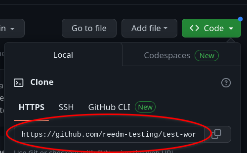

# quarto-pres-template

This repository is a template. It contains all the necessary files for creating a Quarto presentation that published using Github Pages.

## General Guidelines

- This template should also have a "docs" folder after the first time you render "index.qmd"
- "index.html" is the rendered versions of "index.qmd" and will be output into "docs", along other various files, every time you render your presentation.

## Using This Template Repo

1. "Fork" the repo to your own Github account. This creates a copy of it that is yours. This step is necessary because the presentation will be published using the account that houses it on Github, and before forking it the repo is in @ReedMerrill, not your account. :wink:

2. After clicking "fork" you will be given an opportunity to rename the repo, and I recommend doing so because this is the only time it will be this easy. Name it anything that is useful to you. Click "Create fork".

Now you'll be on a page that looks almost exactly like the one we started on before forking, but this time it's a copy of the repo under your Github account. Note too that *this* tutorial (the one you're currently reading) is again at the bottom of the page just like it was before forking. 

3 You will copy your fork of the repo onto your computer. You need its URL, which you can find by clicking on the green "code" button and copying the link under the HTTPS tab. 

## Appendix: Setting up SSH

Github has been implementing added security, and some day you may be required to use SSH rather than HTTPS to clone a repository. The specifics of it aren't too important, but pretty much it is an automatic way for Github to verify that you are who you say you are. You can set up SSH using RStudio pretty easily. Follow the instructions below:

[https://happygitwithr.com/ssh-keys#option-1-set-up-from-rstudio](https://happygitwithr.com/ssh-keys#option-1-set-up-from-rstudio)
